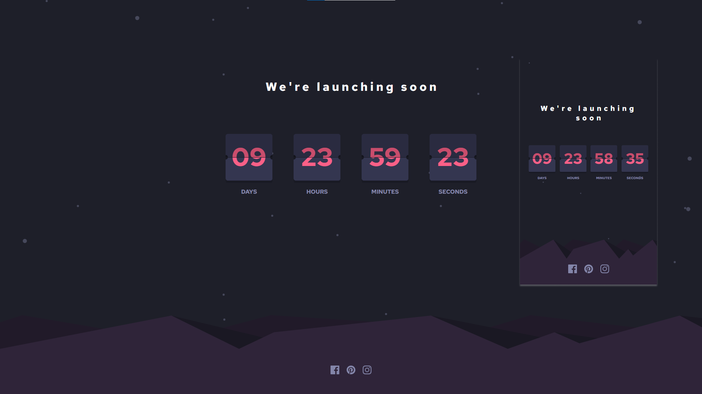

# Frontend Mentor - Launch countdown timer solution

This is a solution to the [Launch countdown timer challenge on Frontend Mentor](https://www.frontendmentor.io/challenges/launch-countdown-timer-N0XkGfyz-). Frontend Mentor challenges help you improve your coding skills by building realistic projects.

## Table of contents

- [Overview](#overview)
    - [The challenge](#the-challenge)
    - [Screenshot](#screenshot)
    - [Links](#links)
- [My process](#my-process)
    - [Built with](#built-with)
    - [What I learned](#what-i-learned)
- [Author](#author)

## Overview

### The challenge

Users should be able to:

- See hover states for all interactive elements on the page
- See a live countdown timer that ticks down every second (start the count at 14 days)
- **Bonus**: When a number changes, make the card flip from the middle

### Screenshot

### Links

- Solution URL: [https://github.com/grzeg95/launch-countdown-timer/](https://github.com/grzeg95/launch-countdown-timer/)
- Live Site URL: [https://launch-countdown-timer-db03f.web.app/](https://launch-countdown-timer-db03f.web.app/)

## My process

### Built with

- [Angular 17](https://angular.dev/)
- CSS Flexbox
- CSS BEM
- Mobile-first workflow

### What I learned

- Svg as template
- Angular animations
- Bypassing html sanitizer

## Author

- Frontend Mentor - [@grzeg95](https://www.frontendmentor.io/profile/grzeg95)
